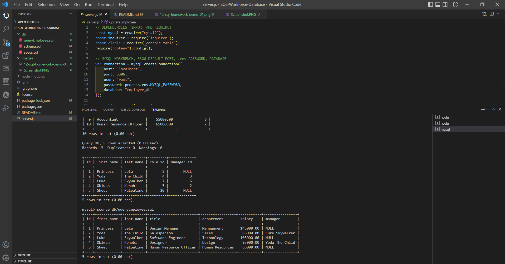

# SQL: WorkForce Database

## Description

Developers frequently have to create interfaces that allow non-developers to easily view and interact with information stored in databases. These interfaces are called **Content Management Systems (CMS)**. Build a command-line application from scratch to manage a company's employee database, using Node.js, Inquirer, MySQL.

## Installation

[Install SQL Shell](https://dev.mysql.com/doc/mysql-shell/8.0/en/mysql-shell-install.html)

Type the following comand to make sure MySQL server is up and running:
```
mysql --version
```

[MySQL2 package](https://www.npmjs.com/package/mysql2) to connect to the SQL database and perform queries. Refer to the queries example in the link.
```
npm install --save mysql2
```

[Inquirer package](https://www.npmjs.com/package/inquirer) to interact with the user via the command line. Refer to the examples on how to use in Node.js.
```
npm i inquirer
```

[console.table package](https://www.npmjs.com/package/console.table) to print MySQL rows to the console. Refer to the examples on how to use in Node.js
```
npm install console.table --save
```
## Usage

Type the following command in the terming to connect to MySQL shell:
```
mysql -u root -p
```

Type the following command to execute the file that contains the list of commands:
```
SOURCE db/schema.sql
```

Then run the seeds file:
```
SOURCE db/seeds.sql
```

Then run the file:
```
SOURCE db/queryEmployee.sql
```

Exit SQL and run in Node Terminal:
```
exit
```

Run the program and follow the prompts:
```
npm start
```

## Password

[To hide password using .env file:](https://www.npmjs.com/package/dotenv)

Create a .env file in source code with the format below. Make sure to hide the .env in the .gitignore 
```
MYSQL_PASSWORD=yourpassword
```

In MYSQL Workbench password section:
```
process.env.MYSQL_PASSWORD
```

Import and Require in dependencies section of the js file.
```
const dotenv = require('dotenv');
```

Run it through the json file.
```
npm install dotenv --save
```

## Items Completed in Project

✅ The command-line application accepts user input.

✅ The user is presented with the following options: view all departments, view all roles, view all employees, add a department, add a role, add an employee, and update an employee role.

✅ When `View all departments` is chosen, the user is presented with a formatted table showing department names and department id.

✅ When `View all roles` is chosen, the user is presentes with job title, role id, the department that role belongs to, and the salary for that role.

✅ When `View all employees` is chosen, the user is presented with a table showing employee data, including employee ids, first names, last names, job titles, departments, salaries, and managers that the employees report to.

✅ When `Add a department` is chosen, the user is prompted to enter the name of the department and then it is added to the database.

✅ When `Add a role` is chosen, the user is prompted to enter the name, salary, and department for that role and then it is added to the database.

✅ When `Add an employee` is chosen, the user is prompted to enter the employee’s first name, last name, role, and manager, and that employee is added to the database.

✅ When `Update an employee role` is chosen, the user is prompted to select and employee to update their new role and is added to the database.

✅ When `Delete Department, Delete Role, or Delete Employee,` is chosen, the user can choose to Delete.

## Hints Given


## Walkthrough Video

* A walkthrough video that demonstrate the functionality of the SQL Employee Tracker

[Screencastify](https://drive.google.com/file/d/1hkmh7WIR1Z1AFCT2YAyO-gfYyUFJsjem/view)

## Screenshot


- - - 
[](https://opensource.org/licenses/MIT)